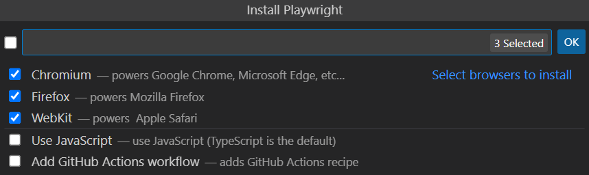

# AutomationWithPlaywright

As the name suggests this project is an example automation project using Playwright and TypeScript.

This project is trying to cover variuse test cases examples that achivable with Playwright.

> Pre requirements:

- [Node setup](https://nodejs.dev/en/learn/how-to-install-nodejs/)
- [VS Code setup](https://code.visualstudio.com/learn/get-started/basics)

## How to use this project:

There are two ways to use this project:

### The first one

- `git clone`
- `playwright vscode extention installation`
- crtl+shift+P -> write 'install playwright' and hit Enter
  
- Hit OK. (You might get asked about generating files that already exists, just hit Enter Enter etc...)

### The secound one

- `git clone`
- `npm i`
- `playwright vscode extention installation`

## Aditional steps

### Environment variables

This project uses [dotenv package](https://github.com/motdotla/dotenv)

Create `.env` file in the root-dir with the following fields  

- `BASE_URL = "<App base url>"`  
- `USER_DATA_DIR = "<Your Chrome User Profile path>"`  
- `USER_EMAIL = "<Your MeetMusic username>"`  
- `USER_PASSWORD = "<Your MeetMusic password>"`  

**Contributors note:** use the method getEnvVars from `helpers/envVars` to fetch `.env` variables.
